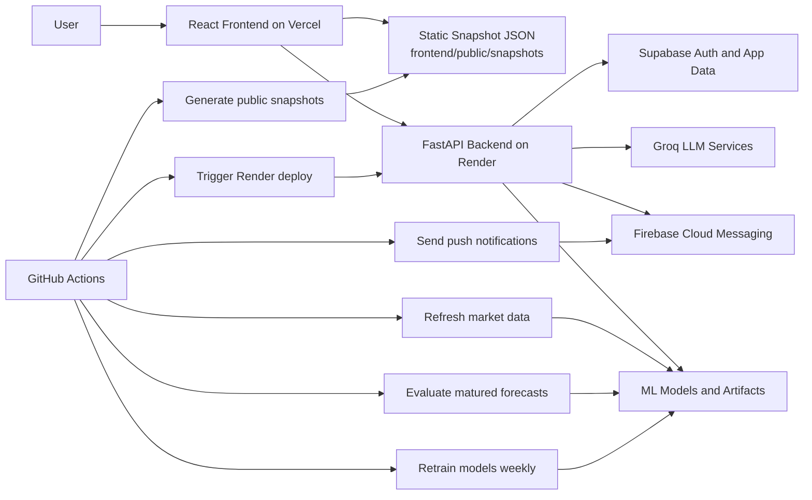

<div align="center">

# GoldSense

### Snapshot-first gold forecasting for Indian users

Instant public forecasts, India-facing gold price estimates, realized accuracy logs, personalized investor guidance, and daily push alerts in one full-stack product.

`React 18` `FastAPI` `XGBoost` `Supabase` `Groq` `Vercel` `Render` `GitHub Actions`

[Quick Start](#quick-start) | [Architecture](#architecture) | [API Map](#api-map) | [Automation](#automation) | [Project Report](./goldsense.pdf)

</div>

## Catch Up Fast

| Topic | What to know |
| --- | --- |
| Main idea | GoldSense predicts the next calendar-day gold close and converts it into India-facing 24k and 22k benchmark estimates. |
| Public UX | The frontend serves static snapshot JSON first, so public pages load fast even if the backend is cold. |
| Private UX | Signed-in users get a dashboard, portfolio context, chatbot help, recommendations, and notification settings. |
| ML loop | Data is refreshed and evaluated daily. Models are retrained weekly. |
| Honesty rule | The app tracks realized forecast logs instead of relying only on backtest claims. |

## Why GoldSense Stands Out

| Public intelligence | Personalized intelligence | Platform reliability |
| --- | --- | --- |
| Today's live or delayed reference price | Profile-based recommendation engine | Daily evaluation of matured forecasts |
| Tomorrow's estimated close | Chatbot with market context | Weekly retraining workflow |
| Monday to Sunday forecast view | Portfolio value context | Static snapshot generation for Vercel |
| Public accuracy history | Browser push alerts | Automated Render deployment hooks |

## Quick Start

If you want to get the project running and understand it quickly, this is the shortest useful path.

### 1. Install dependencies

#### Frontend

```bash
cd frontend
npm install
```

#### Backend and ML

```bash
python -m venv .venv
```

Activate the environment:

```bash
# Windows PowerShell
.venv\Scripts\Activate.ps1
```

```bash
# macOS / Linux
source .venv/bin/activate
```

Install Python packages:

```bash
pip install --upgrade pip
pip install -r backend/requirements.txt -r ml/requirements.txt
```

### 2. Create environment files

Create these files:

- `backend/.env`
- `frontend/.env.local`

Use the values shown in [Environment Setup](#environment-setup).

### 3. Generate local data snapshots

This step makes the public UI immediately useful.

```bash
cd ml
python update_data.py
python evaluate.py
python generate_public_snapshots.py
```

### 4. Start the backend

```bash
cd backend
uvicorn app.main:app --reload --port 8000
```

Open:

- `http://localhost:8000/docs`
- `http://localhost:8000/health`

### 5. Start the frontend

```bash
cd frontend
npm run dev
```

Open:

- `http://localhost:5173`

The Vite dev server proxies `/api` requests to `http://localhost:8000`.

## Architecture



## Product Flow

### Public flow

1. GitHub Actions generates snapshot files under `frontend/public/snapshots`.
2. The public frontend reads those snapshots first.
3. If a snapshot is missing or stale, the UI can fall back to backend prediction endpoints.

### Personalized flow

1. The user signs in with Google through Supabase Auth.
2. The frontend sends the Supabase access token with protected API requests.
3. FastAPI validates the token and loads the user's profile, dashboard data, chat history, and notification settings.

### Forecasting flow

1. `ml/update_data.py` refreshes gold and USD/INR market data.
2. `ml/preprocess.py` merges gold, FX, macro, and sentiment features.
3. `ml/train.py` trains the direction model, magnitude model, and quantile models.
4. `ml/predict.py` creates tomorrow and weekly forecast payloads.
5. `ml/evaluate.py` scores matured predictions against verified data and updates rolling logs.

## Project Map

| Path | Role |
| --- | --- |
| `frontend/` | Vite + React client, public pages, dashboard, auth flow, notifications UI |
| `backend/` | FastAPI app, routers, Supabase integration, Groq integration, push delivery |
| `ml/` | Data refresh, preprocessing, training, prediction, evaluation, snapshot generation |
| `dataset/` | Market CSVs, sentiment logs, prediction logs, cached artifacts |
| `supabase/` | SQL migration for push subscriptions |
| `.github/workflows/` | Daily pipeline, weekly retrain, backend deploy, keep-warm jobs |

### Key files worth reading first

| File | Why it matters |
| --- | --- |
| `frontend/src/App.jsx` | Main route map for the frontend |
| `frontend/src/pages/Home.jsx` | Snapshot-first public experience |
| `backend/app/main.py` | FastAPI entrypoint and router wiring |
| `backend/app/routers/prediction.py` | Public prediction API surface |
| `ml/train.py` | Core model training design |
| `ml/evaluate.py` | Realized forecast evaluation loop |
| `ml/generate_public_snapshots.py` | Static payload generation for Vercel |

## Core Features

### Public experience

- Snapshot-first landing page with fast public data
- Today price card with source and freshness labels
- Tomorrow prediction card with confidence range
- Monday to Sunday weekly forecast
- Public accuracy log built from realized outcomes
- Learn and Dev pages for domain and technical explanation

### Signed-in experience

- Google authentication via Supabase
- Investor profile wizard
- Personalized dashboard
- Recommendation engine powered by Groq plus deterministic context
- Context-aware gold chatbot with saved history
- Browser push notifications for daily forecasts

### Ops and ML features

- Dual-model XGBoost training pipeline
- Quantile confidence interval models
- Macro and sentiment feature engineering
- Daily drift monitoring
- Weekly retraining automation
- Snapshot publication and backend redeploy hooks

## Tech Stack

| Layer | Tools |
| --- | --- |
| Frontend | React 18, Vite 6, Tailwind CSS 4, Framer Motion, Recharts, Axios |
| Backend | FastAPI, Uvicorn, Pydantic Settings, Supabase Python client |
| ML | XGBoost, scikit-learn, Optuna, pandas, numpy, ta |
| Data and signals | Yahoo Finance fallback stack, Alpha Vantage, NewsAPI, RSS sentiment feeds |
| Auth and storage | Supabase Auth, `user_profiles`, `chat_history`, `push_subscriptions` |
| AI | Groq `llama-3.3-70b-versatile` |
| Notifications | Firebase Cloud Messaging |
| Deployments | Vercel frontend, Render backend |
| Automation | GitHub Actions |

## Environment Setup

### Frontend

Create `frontend/.env.local`:

```env
VITE_API_URL=http://localhost:8000
VITE_SUPABASE_URL=https://your-project.supabase.co
VITE_SUPABASE_ANON_KEY=your-supabase-anon-key
```

<details>
<summary><strong>Frontend variable reference</strong></summary>

| Variable | Required | Purpose |
| --- | --- | --- |
| `VITE_API_URL` | No | Backend base URL. Defaults to `http://localhost:8000`. |
| `VITE_SUPABASE_URL` | Yes for auth | Supabase project URL used by the browser client. |
| `VITE_SUPABASE_ANON_KEY` | Yes for auth | Supabase anon key used by the browser client. |

</details>

### Backend

Create `backend/.env`:

```env
SUPABASE_URL=https://your-project.supabase.co
SUPABASE_SERVICE_KEY=your-supabase-service-role-key
GROQ_API_KEY=your-groq-api-key
ALPHAVANTAGE_KEY=
NEWSAPI_KEY=
PUBLIC_APP_URL=http://localhost:5173
ALLOWED_ORIGINS=http://localhost:5173,http://localhost:3000
DEBUG=false
FIREBASE_SERVICE_ACCOUNT_PATH=C:\path\to\firebase-service-account.json
```

<details>
<summary><strong>Backend variable reference</strong></summary>

| Variable | Required | Purpose |
| --- | --- | --- |
| `SUPABASE_URL` | Yes | Supabase URL for backend data access. |
| `SUPABASE_SERVICE_KEY` | Yes | Service role key for trusted backend operations. |
| `GROQ_API_KEY` | Yes for chatbot and recommendations | Groq API key. |
| `ALPHAVANTAGE_KEY` | No | Richer market and sentiment data. |
| `NEWSAPI_KEY` | No | Richer sentiment data. |
| `PUBLIC_APP_URL` | No | Public frontend URL used in deep links for notifications. |
| `ALLOWED_ORIGINS` | No | Comma-separated CORS origins. |
| `DEBUG` | No | Backend debug flag. |
| `FIREBASE_SERVICE_ACCOUNT_JSON` | No | Best for CI and hosted environments. |
| `FIREBASE_SERVICE_ACCOUNT_PATH` | No | Best for local development. |
| `FIREBASE_PROJECT_ID` | No | Optional Firebase credential field. |
| `FIREBASE_CLIENT_EMAIL` | No | Optional Firebase credential field. |
| `FIREBASE_PRIVATE_KEY` | No | Optional Firebase credential field. |

</details>

### Optional pricing and timezone overrides

These are read by `ml/market_data.py`:

| Variable | Default | Purpose |
| --- | --- | --- |
| `GOLDSENSE_CUSTOMS_DUTY` | `0.06` | Customs duty used in India-facing pricing estimates |
| `GOLDSENSE_GST` | `0.03` | GST used in India-facing pricing estimates |
| `GOLDSENSE_MUMBAI_PREMIUM_PCT` | `0.0` | Optional benchmark premium |
| `GOLDSENSE_PUBLIC_TIMEZONE` | `Asia/Kolkata` | Public market calendar timezone |

### Firebase web push config

The frontend reads Firebase web config from `frontend/public/push-config.json`. If you are deploying your own version of GoldSense, replace that file with your Firebase project's web messaging values.

## Supabase Setup Notes

This repo already contains:

- `supabase/migrations/20260412_push_notifications.sql`

The backend expects these tables to exist:

- `user_profiles`
- `chat_history`
- `push_subscriptions`

If you are setting up a fresh Supabase project, make sure:

- Google OAuth is enabled in Supabase Auth
- your redirect URL includes `/auth/callback`
- `user_profiles` is keyed by the authenticated user id
- `chat_history` stores `user_id`, `role`, `content`, and timestamps
- the push-subscription migration is applied before testing alerts

## Machine Learning and Data Pipeline

### Data sources

GoldSense blends:

- gold futures history
- USD/INR history
- macro indicators such as DXY, VIX, TNX, and oil
- sentiment derived from Alpha Vantage, NewsAPI, or RSS feeds

### Model design

The ML stack is intentionally split into separate tasks:

- direction model for up or down movement
- magnitude regressor for next-day log return
- q10 and q90 quantile models for forecast ranges

This allows the app to explain:

- tomorrow's estimated price level
- direction framing versus today's live reference
- confidence intervals for forecast displays

### Key scripts

| Script | Purpose |
| --- | --- |
| `ml/update_data.py` | Refreshes gold and USD/INR datasets from Yahoo provider fallbacks |
| `ml/sentiment_service.py` | Fetches and caches gold-market sentiment |
| `ml/train.py` | Weekly model training with Optuna tuning and walk-forward validation |
| `ml/predict.py` | Builds tomorrow and weekly forecast payloads |
| `ml/evaluate.py` | Evaluates matured predictions and writes system status |
| `ml/generate_public_snapshots.py` | Generates static snapshot JSON for the frontend |

## API Map

Base URL locally: `http://localhost:8000`

### Public routes

| Method | Route | Purpose |
| --- | --- | --- |
| `GET` | `/` | Root metadata |
| `GET` | `/health` | Health and model status |
| `GET` | `/api/prediction/today` | Live or delayed reference price |
| `GET` | `/api/prediction/tomorrow` | Tomorrow estimated close |
| `GET` | `/api/prediction/week` | Current-week forecast |
| `GET` | `/api/prediction/accuracy` | Public accuracy payload |
| `GET` | `/api/prediction/status` | Pipeline and drift status |
| `GET` | `/api/prediction/model-info` | Model metadata |
| `GET` | `/api/prediction/sentiment` | Current sentiment snapshot |

### Protected routes

These require a Supabase bearer token.

| Method | Route | Purpose |
| --- | --- | --- |
| `GET` | `/api/user/profile` | Fetch user profile |
| `PUT` | `/api/user/profile` | Create or update user profile |
| `GET` | `/api/user/dashboard` | Dashboard aggregate payload |
| `GET` | `/api/user/recommendations` | Personalized recommendation |
| `GET` | `/api/user/notifications` | List push subscriptions |
| `POST` | `/api/user/notifications/subscribe` | Upsert push subscription |
| `DELETE` | `/api/user/notifications/subscribe` | Disable push subscription |
| `POST` | `/api/chatbot/message` | Send chatbot message |
| `GET` | `/api/chatbot/history` | Fetch recent chat history |
| `DELETE` | `/api/chatbot/history` | Clear chat history |

## Automation

### Deployment shape

- Frontend is designed for Vercel
- Backend is designed for Render
- `GET /health` is used for monitoring and keep-warm pings
- Render deployment is triggered through a deploy hook

### GitHub Actions workflows

| Workflow | Purpose |
| --- | --- |
| `.github/workflows/daily-evaluate.yml` | Daily data refresh, sentiment refresh, evaluation, snapshots, notifications, artifact commit |
| `.github/workflows/weekly-retrain.yml` | Weekly retraining, artifact refresh, snapshot regeneration, model upload |
| `.github/workflows/deploy-backend.yml` | Triggers Render deployment after backend or model changes |
| `.github/workflows/keep-backend-warm.yml` | Periodically pings the Render health endpoint |

## Generated Artifacts

The repository stores generated artifacts so the public frontend can render instantly:

- `frontend/public/snapshots/today.json`
- `frontend/public/snapshots/tomorrow.json`
- `frontend/public/snapshots/week.json`
- `frontend/public/snapshots/accuracy.json`
- `frontend/public/snapshots/home.json`
- `dataset/prediction_logs.csv`
- `dataset/sentiment_logs.csv`
- `ml/model/model_metadata.json`
- `ml/model/system_status.json`
- `ml/model/pending_prediction.json`

## Honest Limitations

GoldSense is a decision-support system, not a certainty engine.

- Today's value is a live or delayed reference quote, not always the official final close
- Tomorrow's output is an estimated calendar-day close, not a guaranteed outcome
- Weekly forecasts accumulate uncertainty faster than next-day forecasts
- Real-world macro shocks can break historical patterns
- Personalized recommendations depend on profile quality and upstream data quality

The most honest places to inspect reliability are:

- `ml/model/model_metadata.json`
- `ml/model/system_status.json`
- `dataset/prediction_logs.csv`

## License

This project is licensed under the MIT License. See [LICENSE](LICENSE).
